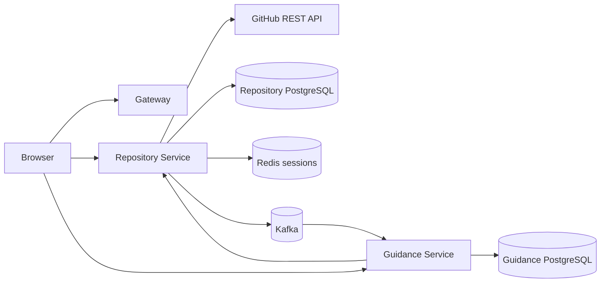

# OpenSource Copilot Backend Architecture

## Service boundaries

The backend is an Nx monorepo containing three NestJS services. Each service owns its application behavior and communicates through contracts or explicit HTTP APIs; no service reads another service's database.

| Service | Responsibility | Owned persistence | Public role |
|---|---|---|---|
| Gateway | Edge foundation, health, request correlation | None | Port 3000 |
| Repository Service | GitHub OAuth, repository import, repository and issue access | Repository PostgreSQL schema, Redis sessions | Port 3001 |
| Guidance Service | Deterministic issue scoring and recommendations | Guidance PostgreSQL schema | Port 3002 |

## Runtime flow

`RepositoryImported` contains only immutable event metadata: event ID, event type, version, timestamp, correlation ID, internal repository ID, and GitHub repository ID. It never contains OAuth credentials, tokens, repository contents, or issue bodies. Guidance consumes the event idempotently and obtains issue data through the Repository Service API.

## Shared libraries

`@osc/contracts` owns API error and event contracts. `@osc/config` owns validated environment configuration. `@osc/observability` owns correlation and structured logging. `@osc/shared` owns bootstrap, validation, exception, health, and Redis primitives. `@osc/github` owns the GitHub HTTP client. `@osc/kafka` owns producer/consumer infrastructure.

## Reliability and security principles

All external inputs are validated through DTOs or response schemas. Internal IDs are UUIDs and GitHub IDs remain separate fields. Authenticated repository access checks session ownership. HTTP clients have bounded timeouts or response sizes, and bounded retries are used only for retryable failures. Correlation IDs are propagated through HTTP and Kafka. Logs redact authorization headers, cookies, and secret-like values.

## Dependency direction

Applications depend on libraries and contracts. Repository and Guidance services do not import each other's Prisma clients. Guidance calls a Repository Service API instead of crossing the database boundary. Shared contracts contain data definitions only and do not depend on application services.

## Phase 4 runtime posture

The shared bootstrap applies bounded JSON and URL-encoded body limits, security response headers, correlation middleware, request latency metrics, and a Redis-backed fixed-window rate limiter. Health liveness is exempt from rate limiting so orchestration can recover instances. Services continue to own their databases, communicate across service boundaries through APIs or Kafka, and do not expose credentials through metrics.
